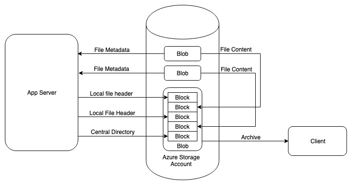

## Create archives directly in Azure

### Use Cases

To handle workloads where we need to provide an archive of a collection of files (Eg - GDPR data export).

### Existing Approaches

The existing approaches for creating archives given a list of files, requires us to stream file contents through the 
application servers. This will have a high cost on network bandwidth.

### Suggested Approach



Azure Blobs comprise of blocks. We can constructing an archive directly in an Azure Blob by creating sections of the 
zip file format in blocks and committing those blocks to the blob. Sections like local file header, central directory 
can be constructed from file meta data. Actual file contents can be copied over from existing blobs, using SAS urls. 
Using this approach, we can bypass pulling file contents in and out of the application server and delegate this heavy 
lifting to the Azure storage account. The only information that we will have to send will be the file metadata which 
is small in size. The network bandwidth required with this approach will be low and cost effective. This approach of 
archiving does not perform any compression.

### Required File Metadata
- File Name
- File Size
- CRC-32 File Checksum

### Why?
- Reduce compute cost for supporting data export use cases
- Help drive usage of Azure Storage

### How to test
1. Clone this repo
2. Set all the required variables in ```ArchiveMain.java```
2. Run the following command ```mvn test```. This should create an archive based on the values set in ```ArchiveMain.java```


